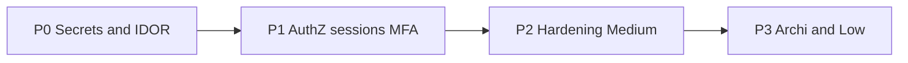

# Plan de remédiation sécurité RASP (3 repos)

**Décisions figées (défauts) :**
- P0 = tous les Critical + High bloquants sécurité ; P1 = reste High + Medium hot ; P2 = Medium restants + Low ; P3 = dette AGENTS.md (Prisma hors modules).
- Breaking change accepté : `metadata.matchedValue` ne sera plus du texte brut (fingerprint hash).
- En `NODE_ENV=production` : `HMAC_REQUIRED=true` et `KEK_MASTER_KEY` obligatoires au boot collector.
- Org roles = `owner | member` seulement ; invite existant = session email match obligatoire.

---

## P0 — Stopper les fuites et l’IDOR (bloquant)

### A. agent-node — redaction / matchedValue
Fichiers clés : [`src/agent.ts`](agent-node/src/agent.ts), [`src/redaction/patterns.ts`](agent-node/src/redaction/patterns.ts), [`src/detectors/suspicious-headers.ts`](agent-node/src/detectors/suspicious-headers.ts), [`src/detectors/custom-rule.ts`](agent-node/src/detectors/custom-rule.ts)

- Remplacer l’émission de match brut par `matchedValueFingerprint` (SHA-256 court) + `matchedValueKind` ; ne jamais mettre `Authorization`/`Cookie`/`Bearer` en clair.
- Étendre `redactValueString` : JWT, `Bearer `, `sk_live_`/`sk_test_`, basic auth, passwords heuristiques ; traiter la clé `matchedValue` comme sensible.
- `metadata.redacted = true` uniquement après scrub réussi ; sinon drop + audit local obligatoire (même si `auditLog: false`).
- Ignorer `valueRedaction: false` dans [`engine.ts`](agent-node/src/redaction/engine.ts) (floor built-in toujours ON).
- `createDefaultDetectors()` → déléguer à `createOfflineDetectors()` ; corriger banking-api + README.
- Retirer / exiger pin explicite de `DEFAULT_POLICY_PUBLIC_KEY` en prod (refuse apply policy sans `policyPublicKey` configuré hors dev).

### B. collector — bind tenant + auth keys
Fichiers : [`persist-heartbeat.ts`](collector/src/modules/ingestion/persist-heartbeat.ts), [`persist-event.ts`](collector/src/modules/ingestion/persist-event.ts), [`api-key.ts`](collector/src/modules/auth/api-key.ts), [`verify-request.ts`](collector/src/modules/auth/verify-request.ts)

- Heartbeat / events / discovery / policy / HMAC : `agent.projectId === auth.projectId` (sinon 404).
- Prefix exact : `rawKey.slice(0, 12)` aligné platform ; candidats plafonnés à 1.
- `resolveHmacSecret` uniquement pour agent du projet authentifié.
- Allowlist metadata events (strip unknown) ; ne plus faire confiance seule à `redacted:true`.

### C. rasp — secrets UI / API
Fichiers : [`agents/[id]/page.tsx`](rasp/app/(app)/dashboard/agents/[id]/page.tsx), [`agents.server.ts`](rasp/modules/agents/agents.server.ts), [`projects.server.ts`](rasp/modules/projects/projects.server.ts), [`api/agents/route.ts`](rasp/app/api/agents/route.ts)

- Page détail + `getProject` : utiliser `AGENT_PUBLIC_SELECT` ; jamais recharger `hmacSecret`.
- Create : retourner `hmacSecret` **une fois** explicitement ; réponses suivantes = public only.
- Strip `keyHash` partout (project GET, includes UI).
- Fix DEK rotate : appeler `rotateProjectKey()` dans [`backoffice/dek/route.ts`](rasp/app/api/backoffice/dek/route.ts) au lieu du create sans `wrappedDek`.

**Tests P0 :** unit redaction leak cases ; collector heartbeat cross-project 403 ; platform agent GET sans hmacSecret.

---

## P1 — Sessions, MFA, RBAC, invites

### rasp auth lifecycle
Fichiers : [`lib/auth.config.ts`](rasp/lib/auth.config.ts), [`lib/auth-helpers.ts`](rasp/lib/auth-helpers.ts), [`proxy.ts`](rasp/proxy.ts)

- Embed `passwordChangedAt` (ou `sessionVersion`) dans JWT ; invalider si DB plus récent (reset + change-password).
- `requireSession()` refuse si `mustChangePassword` sauf allowlist (`/api/account/change-password`).
- Refresh `role` / `mustChangePassword` depuis DB dans callback jwt (ou à chaque `requireAdmin`).

### MFA fail-closed
- [`mfa.server.ts`](rasp/modules/admin/mfa.server.ts) : actions sensibles → 403 si non enrolled.
- Disable MFA : exiger TOTP (+ password).
- Forcer enrollment pour `User.role === "admin"` avant kill-switch / DEK / quarantine.

### RBAC org
- [`mode/route.ts`](rasp/app/api/agents/[id]/mode/route.ts) : `requireOrgRole(owner)` pour `block`.
- Matrice owner-only : create API key, rotate DEK tenant, delete agent, project create/delete, purge (déjà partiel).
- Zod invite/member : `owner | member` only ; accept invite existant = session email match.

### Break-glass / approvals
- Claim atomique token break-glass (`UPDATE … WHERE usedAt IS NULL`).
- `requireAdmin` lit toujours `Authorization` via `headers()`.
- Approvals : executor ≠ requester ; consume `approved→executed` dans la même transaction.

**Tests P1 :** auth-guards étendus (mustChangePassword, mode block, MFA, invite).

---

## P2 — Durcissement Medium (prod defaults)

### collector
- Boot fail si prod sans `HMAC_REQUIRED` / `KEK_MASTER_KEY` / mTLS allowlist non vide quand `MTLS_REQUIRED`.
- Gate `/docs` ; ne pas écrire `Agent.mode` depuis heartbeat ; SSL DB verify-full ; redacter Redis URL logs.
- Outbox ou doc claire + DLQ alert si queue (minimum : catch duplicate jobId → 202).

### agent-node
- Clear `apiKey`/`hmacSecret` de `cfg` après SecureStore ; discovery via redaction ; Fastify dedupe inspect ; ReDoS (cap / RE2 ou skip unsafe) ; refuse `http://` collector en prod.

### rasp
- Rate-limit partagé (Redis) sur auth endpoints si Redis déjà dispo, sinon documenter limite single-instance + rate par email+IP.
- Audit manquant : redaction PATCH, project-rules publish, profile.
- CORS credentials allowlist stricte ; `trustHost` + `AUTH_URL` explicite en prod.
- Kill-switch disable : MFA + dual approval comme enable.

---

## P3 — Dette / Low (après P0–P2)

- Déplacer Prisma des pages dashboard vers `/modules/*.server.ts`.
- Logout POST ; health minimal ; placeholder keys dans `.env.example` ; audit chain advisory lock ; serialize `createAuditLog`.

---

## Ordre d’exécution (PRs)

| PR | Repo | Contenu |
|----|------|---------|
| 1 | agent-node | matchedValue scrub + detectors default + redaction floor |
| 2 | collector | agent↔project bind + prefix keys + HMAC bind |
| 3 | rasp | hmacSecret/keyHash UI + DEK rotate |
| 4 | rasp | JWT invalidation + mustChangePassword API + role refresh |
| 5 | rasp | MFA fail-closed + RBAC block/owner + invites |
| 6 | collector+agent | prod fail-closed HMAC/KEK/mTLS + cfg secret clear |
| 7 | all | Medium restants + tests E2E banking smoke |

---

## Critères de done

- Aucun Critical ouvert ; High P0/P1 fermés ou acceptés explicitement.
- Tests verts : redaction leak suite, collector IDOR, auth-guards.
- Canvas findings mis à jour (status fixed) ou checklist dans le PR final.
- Pas de régression banking-api : heartbeat + event ingest + dashboard agent sans secret permanent.
